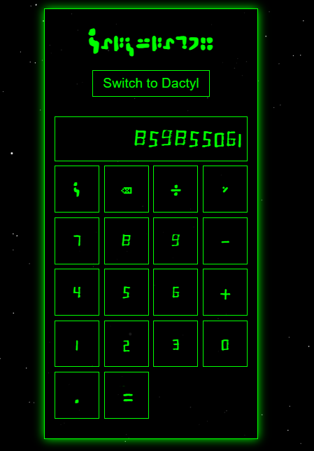
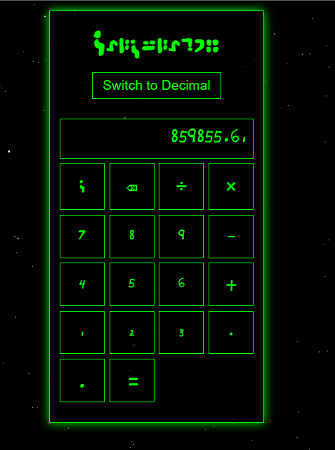

# **Calculator**

A demonstration of the [Dactyl numerals](fonts/dactyl.ttf).

In Dactyl the numbers "grow from seed", as the zero resembles a dot and each successive number is larger, with the 9 being the largest.

See also:
[Dactyl Clock](https://standardgalactic.github.io/dactyl-clock.html)
